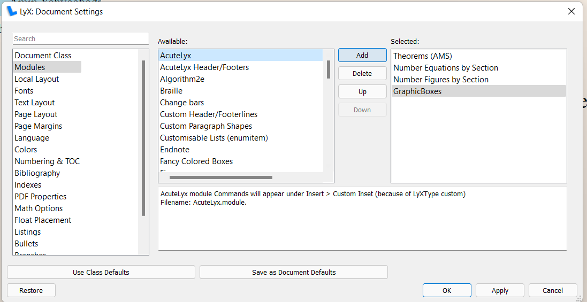
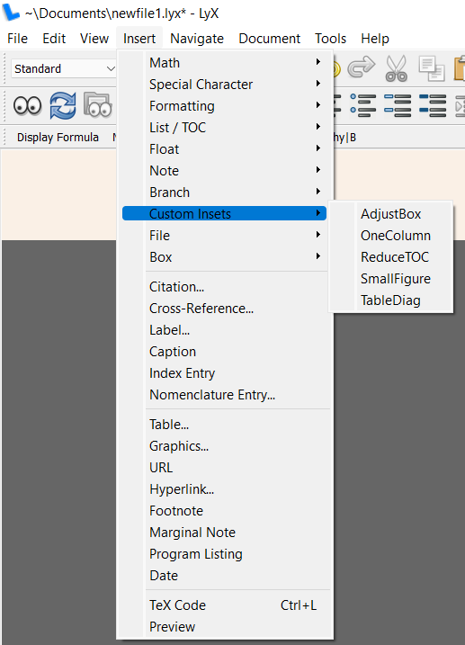

# AcuteLyx (AcuteLatex)

A collection of environments, shortcuts, toolbars, packages, etc. to enhance [Lyx](https://www.lyx.org/Download#toc3).

# Installation

- Open the terminal as Administrator and run the following command.
```
python ./installation.py
```
- Then, from the Lyx toolbar, select `Tools > Reconfigure`.
- When reconfiguration is done, hit the OK, and restart Lyx.

**Note: the installation script is only tested on Windows.** Pull requests for supporting other OS are welcome.

# Lyx Shortcuts

## Normal mode:

Description                                | Shortcut
-------------------------------------------|---------
style the text (font, size, etc)           | `ALT-T`
layout-paragraph                           | `ALT-P`
add a new section/environment              | `ALT-S`
add label (for figures, equations, etc.)   | `ALT-M`
add citation                               | `ALT-C`
add a reference to a figure/table/equation | `ALT-R`
add hyperlink                              | `ALT-H`

## Math mode:

Description              | Shortcut
-------------------------|---------------
inline math              | `CTRL+M`
standalone math          | `CTRL+SHIFT+M`
numbered math            | `CTRL+ALT+N`
convert to numbered math | `CTRL+ALT+M`
text in math (\\mbox)    | `ALT-T`
fractions (\\frac)       | `ALT-F`
brackets                 | `ALT+M+[,{,(`

# Using The Environments

- Select `Documents > Settings` from the Lyx Toolbar,
- Select `Modules`. Then select `AcuteLyx`
- Press `Add` and then `Apply` to load the module. Do the same thing for `AcuteLyx Headers/Footers`



The added environments will appear under `Insert > Custom Insets`



# Uninstallation

Open terminal as Administrator and run the following command. Then, from the Lyx toolbar, select `Tools > Reconfigure`. When reconfiguration is done, hit OK, and restart Lyx.
```
python ./uninstallation.py
```
